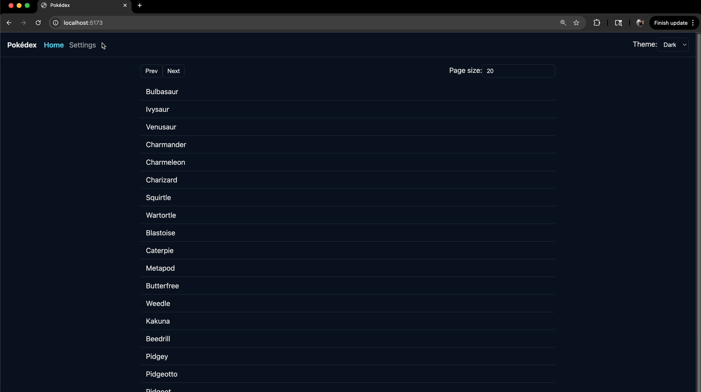

# React Pokédex Interview Exercise

This repo is a Vite + React + TypeScript Pokédex that uses Redux Toolkit and RTK Query with the public PokéAPI.
Some functionality has been intentionally broken or removed. Your task is to fix the issues.
Expected time: 45 minutes. Favor pragmatic, well-reasoned changes over large refactors.

## Getting started

- Create a new branch named `{firstName}-{lastName}`
- Install deps and start the dev server:
  - npm install
  - npm run dev
- Commit changes for every task below
- At the end of the interview please push up your change set     

## What to fix (in any order)

Add brief comments near changes that aren’t obvious. It’s fine to choose reasonable approaches if something is underspecified.

1. Pagination is broken on the list view

- Symptom: Prev/Next don’t advance correctly on the pokemon list.
- Acceptance: Prev/Next navigate pages correctly and fetches the correct list of pokemon.

2. Detail page does not load

- Symptom: The detail route fails to render.
- Acceptance: Detail page renders sprite and base fields without errors.

3. Theme is broken

- Symptom: Theme toggle doesn’t change the layout from light to dark mode.
- Acceptance: Toggling theme updates colors immediately and survives navigation (persisting across refresh is a nice-to-have).

4. Settings: Detail field visibility is broken

- Symptom: Toggles on Settings don’t affect which sections render on the detail page.
- Acceptance: Toggling a field (types, abilities, height/weight, stats, description) hides/shows the corresponding section.

## References

- Redux Toolkit: https://redux-toolkit.js.org/
- RTK Query: https://redux-toolkit.js.org/rtk-query/overview
- React Router v6: https://reactrouter.com/en/main
- PokéAPI: https://pokeapi.co/

## Demo of working app

